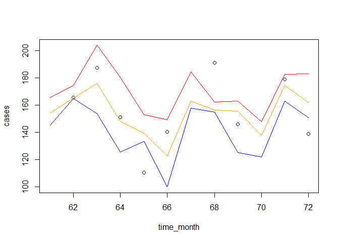

<!-- README.md is generated from README.Rmd. Please edit that file -->

# t4dse - Tools for Data Science and Epidemiology

<!-- badges: start -->

<!-- badges: end -->

The goal of `t4dse` is to share a collection of tools developed during
the writing of the research project at [ITM](https://www.itg.be/) /
[IPK](https://instituciones.sld.cu/ipk/) /
[UGent](https://www.ugent.be/). This r package contains functions and
data for disease stratification and intervention evaluation.

This will help data science experts and epidemiologist with the
computation of epidemiological statistics, like the creation of
endemic/epidemic channels using surveillance data.

## Installation

You can install the development version of `t4dse` from
[Github](https://github.com/) with:

``` r
# install.packages("devtools")
devtools::install_github("wbal/t4dse")
```

## Example

This is a basic example which shows you how to create an endemic channel
for 2019 using `t4dse::endemicchannel()`. This requires a data frame
containing monthly cases from 2014 to 2019:

``` r
library(t4dse)
## basic example code

  set.seed(1)
  x=seq(0,12*6-1)
  y=100 + 20*cos(2*pi*x/12) + rnorm(n = length(x),mean = 50,sd = 40)
  y[y<0] <- 0
  data14a19 <- data.frame( idx=seq(1,12*6), year=rep(2014:2019, each=12 ), month=rep(1:12, 6), cases=y )

  endchan2019 <- endemicchannel(data =data14a19
                           ,yearnow = 2019,period = "month"
                           ,.var = "cases"
                           ,nyears = 5)
  
 endchan2019
#>    year month   median  supramin inframax
#> 1  2019     1 154.2284 145.15038 165.5062
#> 2  2019     2 165.0754 164.94797 174.6662
#> 3  2019     3 175.9242 153.76818 204.0010
#> 4  2019     4 148.2027 125.51894 180.5270
#> 5  2019     5 139.3524 133.41906 153.1803
#> 6  2019     6 122.5450  99.86076 149.3972
#> 7  2019     7 162.8488 157.87854 184.3472
#> 8  2019     8 156.4355 154.94602 162.2125
#> 9  2019     9 155.5069 125.31114 163.0313
#> 10 2019    10 137.7845 121.70019 147.8478
#> 11 2019    11 174.5833 162.98260 182.7888
#> 12 2019    12 161.9183 150.72073 182.9142
```

Plotting the endemic channel:

``` r
  time_month = data14a19[data14a19$year==2019,]$idx
  cases = data14a19[data14a19$year==2019,]$cases
  plot( x = time_month, y = cases 
        , ylim = c( min(endchan2019$supramin,na.rm = TRUE ),  max(endchan2019$inframax,na.rm = TRUE ))  )
  lines( time_month,y= endchan2019$supramin, col="blue" )
  lines( time_month,y= endchan2019$inframax , col="red")
  lines( time_month,y= endchan2019$median , col="orange")
```

<div class="figure">


<p class="caption">

Endemic Channel, 2014-2019.
</p>

</div>

## References

- Baldoquín Rodríguez, W.; Mirabal, M.; Van der Stuyft, P.; Gómez
  Padrón, T.; Fonseca, V.; Castillo, R.M.; Monteagudo Díaz, S.; Baetens,
  J.M.; De Baets, B.; Toledo Romaní, M.E.; Vanlerbeghe, V. . The
  Potential of Surveillance Data for Dengue Risk Mapping: An Evaluation
  of Different Approaches in Cuba. Trop. Med. Infect. Dis. 2023, 8, 230.
  <https://doi.org/10.3390/tropicalmed8040230>

- Baldoquín Rodríguez, W.; Gómez Padrón, T.; Valdés García, L.E.;
  Rodríguez Valdés, A.; Castillo R.M.; Del Pozo de los Reyes, D.;
  Baetens, J.M.; De Baets, B.; Toledo Romaní, M.E.; Vanlerbeghe, V.
  Effectiveness of a multicomponent dengue prevention strategy targeting
  transmission hotspots in Santiago de Cuba, Cuba, 2015-2020 \[in
  review\]
